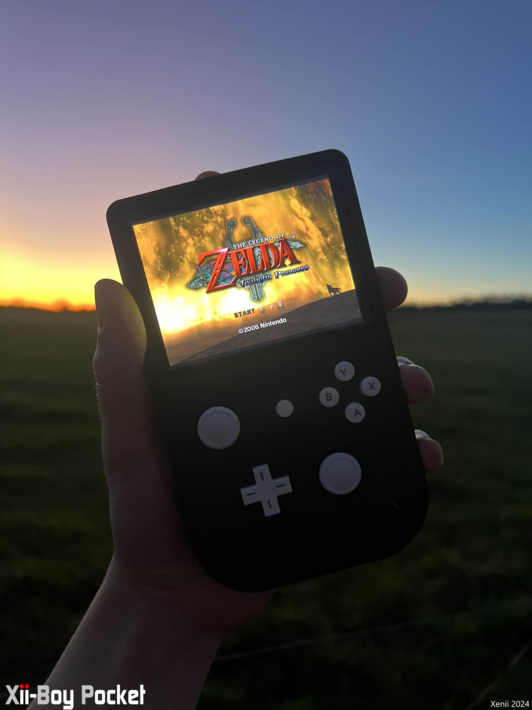
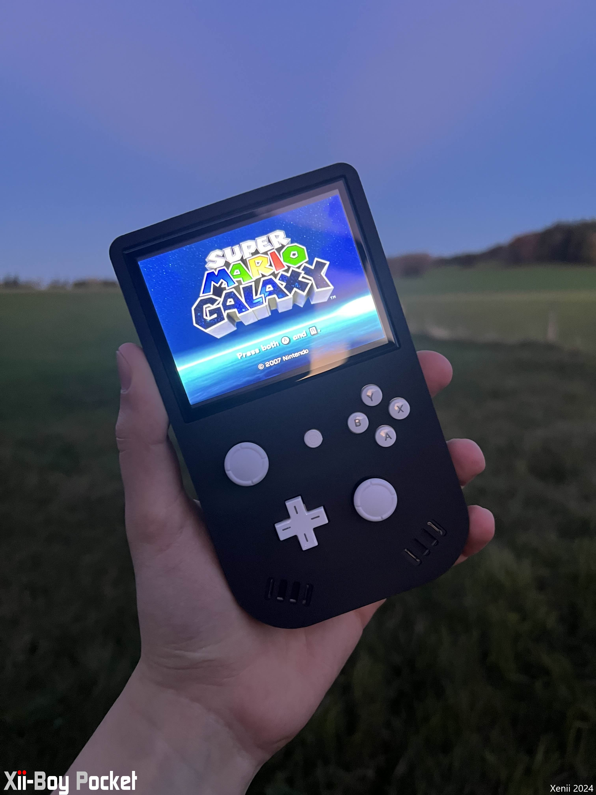

<picture> <source media="(prefers-color-scheme: dark)" srcset="Images/XBP-Logo-Light.png" width="800">  </picture> 

The Xii-Boy Pocket is a small portable Wii using a Game Boy form factor. The Xii-Boy Pocket is the second version of my Xii-Boy design.
This new portable Wii is now better, thinner, and above all, Open-Source ! Compared to the Gboy Rev III, it is 25% smaller and 5mm thinner !

If you want to learn more about it, you can check this BitBuilt Thread: [Xii-Boy Pocket's Thread](https://bitbuilt.net/forums/index.php?threads/the-xii-boy-pocket-v2.6638/)

If you want to see its development, you can check this BitBuilt Worklog: [Xii-Boy Pocket's Worklog](https://bitbuilt.net/forums/index.php?threads/xii-boy-v2-xeniis-second-portable-wii.6374/)

You can also learn more about the Xii-Boy Original here: [Xii-Boy Original Thread](https://bitbuilt.net/forums/index.php?threads/the-xii-boy-xeniis-first-portable-wii.6327/)

 

If you have any questions or problems about the Xii-Boy Pocket, please let me know 😉 Enjoy !

# Parts
All the parts you need to assemble a Xii-Boy Pocket are listed in the [Xii-Boy V2 Parts List.pdf](https://github.com/Xenii1642/Xii-Boy-Pocket/blob/main/Xii-Boy%20V2%20Parts%20List.pdf) file.

⚠ NOTE ⚠ For the batteries, I personally order mine through [Akkuteile](https://akkuteile.de/). However, if you don't live in Europe, you should buy your batteries somewhere else.
You just have to order two 18650 batteries. You shouldn't order them through Aliexpress, they could be fake and maybe dangerous

# PCB
All the Gerbers you need for the Xii-Boy Pocket are available in the [Gerber](https://github.com/Xenii1642/Xii-Boy-Pocket/tree/main/PCB%20Files/Gerber) folder.

All the needed components are listed in the [Xii-Boy V2 PCB BOM.pdf](https://github.com/Xenii1642/Xii-Boy-Pocket/blob/main/Xii-Boy%20V2%20PCB%20BOM.pdf) file.

The Xii-Boy Pocket's PCBs need specific settings to work properly:

### **Controller PCB**:
- ENIG surface finish 
  
### **Xii-Flex**:
- 0.12mm thickness
- Stiffener Polyimide 0.2 mm
  
### **Main PCB**:
- Impedance Controll YES
- Impedance Controll profile JLC04161H-7628

The other PCBs don't need specific settings. You can just let the setting by default 👍

I personally ordered mine through [JLCPCB](https://jlcpcb.com/) 👍

# Case
All the needed STLs are available in the [STL](https://github.com/Xenii1642/Xii-Boy-Pocket/tree/main/STL) folder.
If you want to order your case in **nylon** or **resin** through [JLC3DP](https://jlc3dp.com/), please use the case available in the [Case (JLC)](https://github.com/Xenii1642/Xii-Boy-Pocket/tree/main/STL/Case%20(JLC)) folder.

Otherwise, if you want to print / order it in FDM, use the case available in the [Case (FDM)](https://github.com/Xenii1642/Xii-Boy-Pocket/tree/main/STL/Case%20(FDM)) folder.

⚠️ Some of the buttons and fixations are too small to be manufactured by JLC3DP. To fix that, you can find a file which contains all the too small pieces [here](https://github.com/Xenii1642/Xii-Boy-Pocket/blob/main/STL/Buttons/Buttons-JLC.stl) ⚠️

I personally ordered my case through [JLC3DP](https://jlc3dp.com/) in **nylon SLS** and I printed the buttons in PLA 👍

⚠ NOTE ⚠ JLC3DP may ask you that there are some risks that the case could have warping or cracks. You have to accept them 👍

# STEP Files
You would like to make an edit on the case? No worries! You can find STEP files of the case in the [STEP folder](https://github.com/Xenii1642/Xii-Boy-Pocket/tree/main/STEP)
